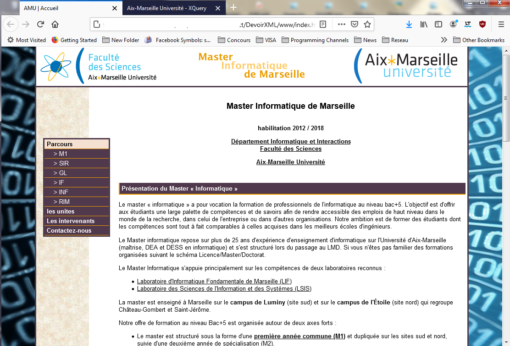
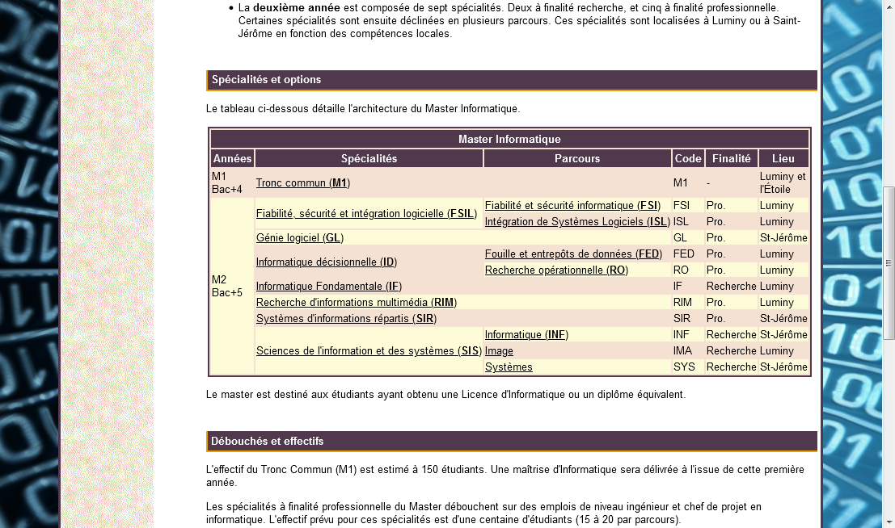
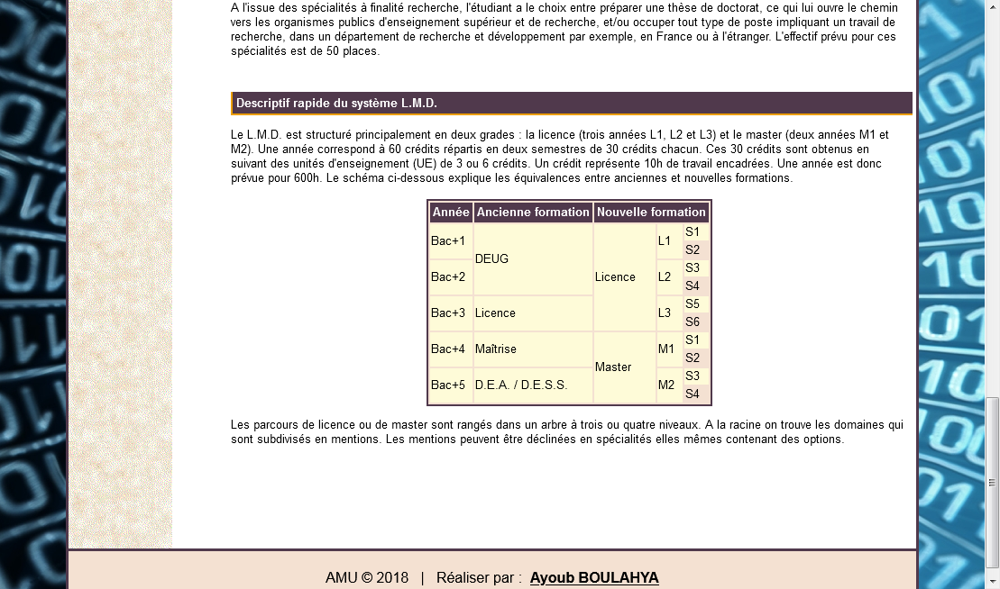
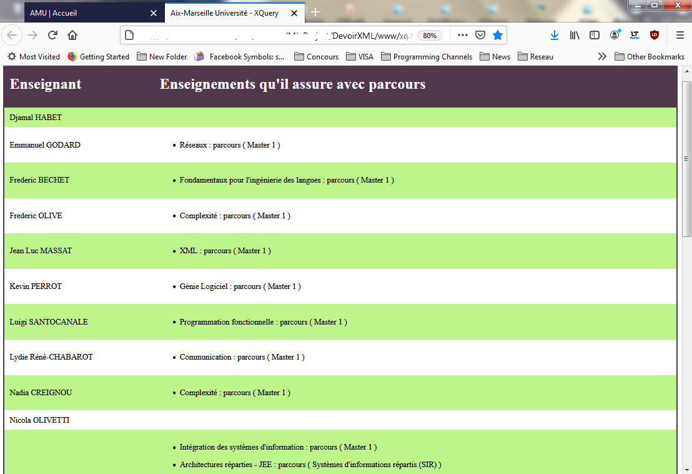
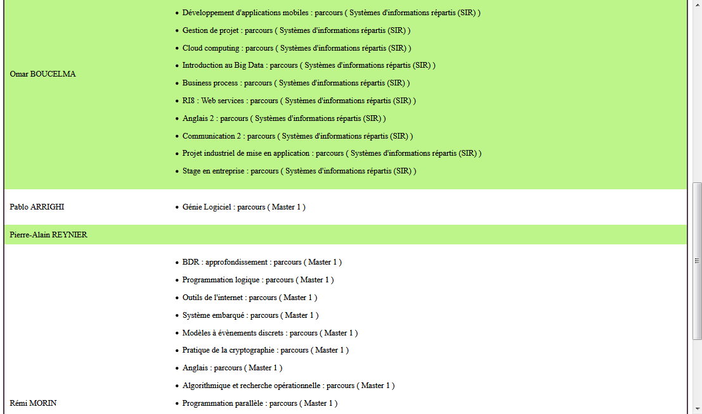

# Projet_AMU_XML_XQuery des parcours de Master 1 d'Aix-Marseille Université
 
| Projet XML, Master 1 Informatique |
| ------ |
| Parcours : Ingénieurie du Logiciel et des Données / Aix-Marseille Université - Luminy |
| Projet `Projet_AMU_XML_XQuery` (v.0.0.1) |
***********************************************************************
## Features
`Projet_AMU_XML_XQuery` utilise diverses technologies qui tournent autour de la manipulation de fichiers XML pour exécuter des requêtes XQuery et de générer des fichiers HTML avec les noms des intervenants, les unités d'enseignement et les parcours de la formation de Master 1 d'Aix-Marseille Université en gardant une liaison entre les fichiers HTML générés afin de donner un joli site web riche et informatif.

> N'hésitez pas à faire un petit tour sur le rapport du projet pour plus de détails. Veuillez le trouverez dans le document PDF suivant :
[Rapport de projet]

## Tech
- Java
- XML
- XPath (version 2.0)
- XQuery
- DTD
- XSLT
- SAXON la bibliothèque de [saxonica] : le processeur XSLT et XQuery
- HTML
- ✨CSS✨

## Prè-installation
Afin d réussir le bon usage de ce projet, vous allee besoin :
- D'un systeme d'exploitation Linux
- Vous devez télécharger le fichier [saxon9he.jar] et le placer dans le dossier nommé `java` pour le répertoire parent du projet en cours.

## Installation
Pour exécuter tous les requêtes à la fois, veuillez utiliser le Makefile de projet :
```sh
$ make -f Makefile
```
## Affichage
Après avoir exécuté le `Makefile`, certains dossiers et fichiers seront créés, y compris un dossier nommé `www`, à l'intérieur de ce dernier, double-cliquez sur le fichier `index.html`, puis vous pouvez vous amuser à naviguer librement sur le site 😉 comme les montrent les captures d'écrans ci-dessous :

### Screenshots :

#### Home




#### XQuery



## Nettoyage
> 💡 Note : pour effectuer un nettoyage afin d'exécuter à nouveau le Makefile, tapez la commande suivante :
```sh
$ make clean
```
 
## Contact
> `boulahya.ayoub@gmail.com`
 
> `ayoub.boulahya@etu.univ-amu.fr`

 
## License
**Free Software, Hell Yeah!**

[Rapport de projet]: <https://github.com/Ayoub-BL/Projet_AMU_XML_XQuery/blob/master/doc/Rapport.pdf>
[saxonica]: <https://www.saxonica.com/welcome/welcome.xml>
[saxon9he.jar]: <https://www.saxonica.com/download/download_page.xml>